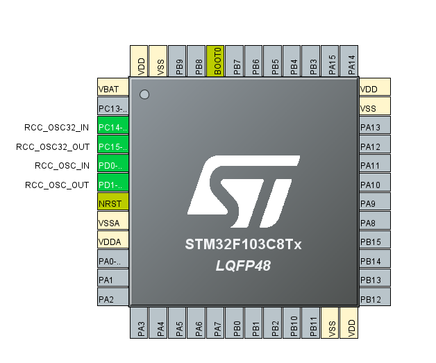
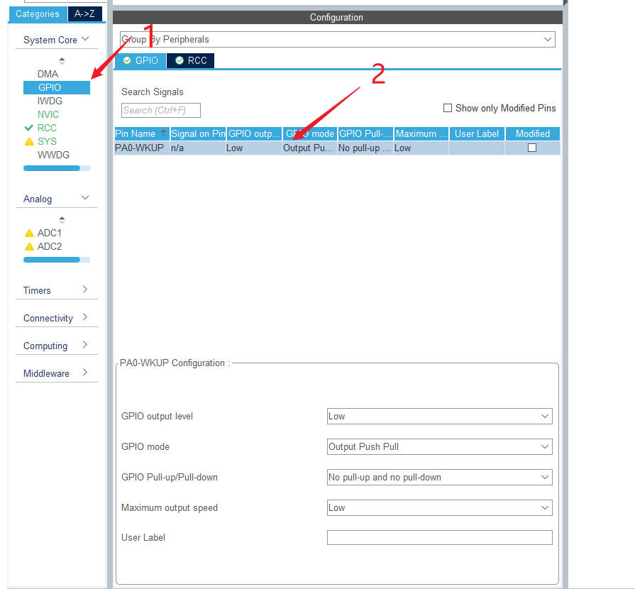

<p align="center"><a rel="license" href="http://creativecommons.org/licenses/by-sa/4.0/"></a></p>

<p align="center"><b>本作品采用<a rel="license" href="http://creativecommons.org/licenses/by-sa/4.0/">知识共享署名-相同方式共享 4.0 国际许可协议</a>进行许可。</b></p>

<p align="center"><b>This work is licensed under a <a rel="license" href="http://creativecommons.org/licenses/by-sa/4.0/">Creative Commons Attribution-ShareAlike 4.0 International License</a>.</b></p>

# 背景与现状

军人作为现代社会建设的重要力量，在退伍后依然是非常重要的资源。我国历来对退伍军人的生活情况非常重视，积极推动退伍军人就业创业，充分挖掘退伍军人资源价值，这对于保障退伍军人生活、维护经济稳定发展、提高社会建设水平有着非常重要的作用。调查显示，创伤后应激障碍（PTSD）在退伍军人中的患病率估计约为23%。从未被部署的服役人员和因光荣退伍而离开的服役人员自杀的风险最高，切实关注退伍军人的身心健康是社区治理工作中的重要主体。

近年来，全国各大社区围绕政策宣传、困难帮扶、就业创业、尊崇氛围等方面落实退伍军人的日常保障，强化退伍军人与社区的感情连接，促进双向发展，从退伍军人的自身需求出发，统筹安排、分类施策，搭建全方位、多角度的服务保障体系，让他们切身感受到被需要，被陪伴，被关怀，从而不断优化社区治理体系，提高社会治理现代化水平，真正做到智慧社区温暖每一颗心。

# 探究目的

## 项目整体

创建一个为退伍军人服务的智慧社区，是我们深思熟虑的结果。退伍军人这一群体年龄普遍偏大，脱离长期的军队生活会带来强烈的不适应感，最重要的一点在于那些身边陪伴的熟悉战友也渐渐离开。曾经他们朝夕相对，相伴多年，一起训练，一起生活，是彼此深厚感情的支撑。面对新的生活环境带来的苦闷与心酸，退伍军人这一庞大群体如何建立新的朋友圈，如何快速发展生活圈是一大难题。在科学技术迅速发展的今天，如何利用人工智能技术使退伍军人更好地融入社区亟待解决。在国家危难时，他们冲在前线，现在他们退伍了，我们义无反顾主动站出来，为他们打造一个舒适的智能生活环境，真正做到用技术简化生活方式，提高生活品质，利用人工智能技术帮助退伍军人群体实现享受美好生活的愿望。

## 智慧社区APP前、后端

在信息时代，手机、电脑等已是每个人都离不开的东西。在手机上就能系统高效地完成大部分的社区事务是我们梦寐以求的事情。因此，开发全套的智慧社区APP迫在眉睫。当然，全栈开发也是一项极具挑战性的任务，我们会尽力而为。

## 智能小车

在生活中，我们常常会遇到有快递但是忘记去取、作为访客进入小区找不到指定住户等问题。对此，我们设计了一个相关的解决方案。

我们可以制作一个智能小车，该智能小车可以配合智能快递柜进行快递分发的任务，也可以用来运送货物、带路等。智能小车中部有几个格子可以用来存放运输的快递，到达指定用户家门口时，格子后面的门打开，快递掉落在地上，从而完成送快递的任务。同理，该智能小车也可以运送外卖等易碎物品，但这要求用户在家。待小车到达门口后，格子前面的门打开，用户自行把外卖等物品取出。当智能小车空闲时，可以用于清扫落叶、带领访客到达指定住户门口的任务，也可用作移动的监控。我们希望这个小车能为住户带来更多的便捷。

# 概念界定

## 情境感知

通过各种传感器等硬件，感知社区中发生的一切。如通过光电传感器感知有人翻越围栏；通过摄像头结合人工智能技术识别陌生面孔等。

## 身份ID

### 概述

身份ID是每个用户在社区中通用的唯一ID。

### 形式

#### 生物特征

1. 人脸
2. 指纹
3. 掌静脉

#### 实体ID

1. 临时二维码（出闸即毁）
2. 卡（身份证、手机NFC）

### 事项

其中，生物特征最值得信任，实体ID可能易伪造。所以我们在设计时尽可能缩小实体ID的形式和使用场景，避免伪造与滥用，确保社区安全。

## 智能闸机

社区的智能闸机带有显示屏和扬声器等设备，支持识别身份ID，可以以任意宽度部署，可以通过语音播报状态信息（如放行、分配的电梯等），方便不同人群。

## 智能停车场

### 概述

为配合社区其他功能区域，停车场也需要进行智能化。

### 设计

#### 导航

停车场内部安装了定位系统，可以通过多点测距的方式为停车场内的终端发送坐标信息，同时我们为停车场建立模型并绘制地图，从而实现在停车场内的导航和自动驾驶。

#### 充电区

停车场的充电区被特别保护，使用道闸控制进出。对充电的限制是基于此完成的。

## 电梯系统

为提升电梯运输效率和社区的整体安全性，智慧社区使用“智能分配系统[^智能分配系统]”控制电梯。

[^智能分配系统]: 这是通力公司的智能选层系统解决方案：<https://www.kone.hk/zh/new-buildings/Advanced-People-Flow-Solutions/destination-solutions>。

> 传统的电梯大多只有上下呼叫按钮。乘客进入电梯后才能选择想要前往的楼层。由于系统不能预知所有使用者需前往的楼层，电梯内会有前往不同楼层的乘客，停层需要的时间也较多。
>
> 故传统电梯系统让电梯行程时间较多，甚至会造成电梯系统中所有电梯同时上升或同时回到主层，直接影响电梯等候时间及效率。
>
> 智能分配系统能在乘客按下想要前往的楼层时，即时对他们作出分类及编配到所属的电梯，使系统能于最短时间运送所有使用者。
>
> 编配方式可因应情况而转变，例如前往高层、低层或相邻楼层的，都会编配到同一部电梯，避免“层层停”或“同上同下”等低效率情况出现。[^智能分配系统引用参考]
>
> [^智能分配系统引用参考]: 参考了<http://www.hkelev.com/elev_miconic10.htm>。

我们设计了多种呼叫电梯的方式。首先是靠近电梯时可采用的：通过公共楼层电梯大厅的闸机、使用电梯厅的智能终端。然后是随处可用的：通过智慧社区APP、使用各处的智能终端。

# 运用方法

在该项目的探究中，我们充分运用各种探究方法来发现并尝试解决生活中的各种问题，这些方法主要有以下几种。

## 信息研究法

我们使用网络搜索引擎收集了目前对于退伍军人、老年人及普通人对于高质量社区生活的需求，并通过计算机将它们整合分析。

## 调查法

我们通过网上问卷、线下调查等方式收集了周边居民对于他们社区中一些弊端的看法，并通过计算机将它们整合分析。

## 观察法

我们也通过观察，亲身体会了自己社区中的一些不足，企图通过该项目的探究来改变它们。

# 过程与内容

## 面临的问题与创新点

: 面临的问题与创新点

| 问题 | 创新点 |
| --- | --- |
| 使用户能通过自己最熟悉的方式使用智慧社区APP | 使用开源的跨平台UI框架Flutter，而不是仅为单一平台构建。 |
| 通过网络后端为智慧社区APP提供服务 | 使用开源Parse Platform构建的安全、高效的应用后端，为应用提供了贯穿型、一站式的服务，大大简化了后端开发，提升了用户体验。 |
| 退伍军人转接工作进度慢，流程繁琐 | 直接通过调取政府授权的信息，快速接入社区管理系统。 |
| 学习教育等记录工作不清晰 | 智慧社区APP可以记录用户的学习，根据个人情况推荐合适的课程。 |
| 医疗辅助设施利用及人员调配效率低 | 在智慧社区APP中，可以对导盲犬、健身器材等进行预约，也可以一键向社区健康服务中心求助。 |
| 用户忘记取快递 | 智能小车设有格子存放快递，到达用户家门口后，格子后面的门会自动打开，快递掉落在地上，无需用户亲自前往快递柜取货。 |
| 找不到指定住户 | 智能小车可配合智能快递柜进行快递分发，也可以带领访客到达指定住户门口，提高了社区的出行安全性。 |
| 社区某些位置可能会有垃圾、落叶等 | 智能小车可以用于清扫落叶，提高了社区的整洁程度。 |
| 社区需要更加全面的监控设施 | 智能小车可以用作移动监控，提高了社区的安全性。 |

## 全局架构

### 作者

胡睿邈、胡轩霖

### 信息采集与个人档案建立

#### 概述

通过与相关部门对接来完成信息的采集和个人档案的建立，从而为社区成员提供更好的服务。

#### 流程

##### 与政府对接

通过与政府对接，我们能对每一位用户的家庭情况、服役情况和教育水平等信息有一定了解。

##### 与医疗系统对接

我们可以与医疗系统对接来获得用户的健康状况。

### 身份ID申请

#### 概述

除社区退伍军人自动分配身份ID外，其他用户想要进出社区需先取得一个身份ID。

#### 方式

##### 临时访客

###### 单次访问

单次访问的访客可以在访问前向住户索取邀请链接并自主登记，也可以在社区服务中心进行申请、登记。

###### 长期往返

长期往返指在一个比较长的时间内多次进出社区。这类访客需要在智慧社区APP或社区服务中心登记长期往返需求，社区根据实际往返频次和该用户在社区内的表现记录，每次[^每次登记长期往返]给予其一周至一月的临时访客身份ID

[^每次登记长期往返]: 前提是上一个临时ID已过期。

##### 外卖人员

外卖人员需在第一次访问时登记个人信息并创建身份ID，同时将公开配送信息接入系统以实现智能服务。

### 进出社区的智能化流程

#### 概述

该部分阐述了用户进入社区的智能化流程，以一种安全便捷的方式为用户提供了智能化的体验。

#### 流程介绍

##### 通过闸机

用户可以使用身份ID，通过闸机进出社区。

##### 进入停车场

###### 概述

当用户驾驶机动车辆（七座及以下）进入社区时，系统会根据车位剩余情况及目的地分配车位，车主可以根据停车场内标识牌指引前往停车。

###### 特殊情况

若欲进入的车辆为新能源车，车主可在登记进入社区时或日常通勤设置中登记需要充电，也可以通过手机或车机上收到的通知临时登记。登记后，系统将为需要充电的车辆分配充电车位。需要注意的是，如果车主将车辆泊入充电车位但不充电，或收到移车请求后不采取行动，将被梯度限制充电权限。

若车主安装了智慧社区APP，系统将为车主的手机或车机发送目的地并询问是否进行室内路线引导，使用动画指引停车。

若车主的车辆支持自动驾驶且与智慧社区系统对接，系统将询问是否直接接管车辆自动驾驶，自动泊入目标车位。

#### 特殊情况

##### 串门

如果用户有串门的需求，可以通过智慧社区APP或家中的智能终端互相邀请和申请。如果用户感到烦人，可以进行隐私设置。这种方式方便了安全管理的同时也能解决寻找家人[^找家人]的问题。

[^找家人]: 在我的社区中，经常会出现家长在业主群里寻找老人小孩的情况。

##### 外卖

社区中经常会出现外卖人员，如何处理好这类特殊人员的需求并同时保证社区相对安全是一个比较棘手的问题。

对于外卖人员，系统会在其进入社区执行配送任务时根据公开的配送信息分配一条合理的配送路线并为其发送通知。只要配送路线还中存在某个楼栋，那么这个楼栋的闸机将为其开放。在同一楼栋内，配送员需遵循楼层路线。这样可以避免在同一楼栋内移动时，手动操作选择目的楼层和由于配送而暂时离开电梯导致降低配送效率的问题。

### 智能化联动

#### 概述

用户进入社区后，绝大部分情况是回到家中休息；离开家之前也需要做一些繁琐的收尾工作。我们可以利用这一点，提供一些与智能家居等设备的联动来解放双手。如果用户有能力进行简单的编程，我们也可以提供编程的方式来允许用户创造属于自己的联动条件。

#### 例子

家居联动是让退伍军人体会到科技的便捷之处的一个较为直接的方式，可以提升他们的生活质量和幸福感。我们可以提供这样的设置：进入社区后，如温度高于27摄氏度，开启空调制冷，温度低于20摄氏度，开启制热。

## 智慧社区APP后端

### 作者

胡睿邈

### 服务器准备

要提供连续流畅的网络服务，我们需要一个稳定、轻量的计算机。Raspberry Pi[^raspberry-pi]是一个很好的选择。在本项目中，我们选用了Raspberry Pi 4 Model B（<https://www.raspberrypi.com/products/raspberry-pi-4-model-b>）。

[^raspberry-pi]: Raspberry Pi 消除了所有人群进入计算的高昂成本：虽然儿童可以从以前不向他们开放的计算教育中受益，但许多成年人历来也因价格过高而无法使用计算机进行企业、娱乐和创造力。Raspberry Pi 消除了这些障碍。参见<https://www.raspberrypi.com/about>。

### 运行方法

#### 安装MongoDB

> 借助基于领先的现代数据库构建的应用程序数据平台，更快地将您的想法推向市场。支持事务性、搜索、分析和移动使用案例，同时采用通用查询接口和开发人员喜爱的数据模型。

MongoDB（<https://www.mongodb.com/zh-cn>）是一种现代数据库平台，支持事务性、搜索、分析和移动应用使用案例。它具有灵活的文档数据模型和适用于各种非用例的统一查询接口，能够提高交付和迭代速度。它可以在任何环境中满足性能SLA要求，并可以轻松实现高可用性，保护数据完整性，并满足关键任务工作负载的安全性和合规性标准。MongoDB由开发者构建，供开发者使用，支持更快、更灵活的应用程序开发。

要安装MongoDB，首先需要从官网（<https://www.mongodb.com/try/download/community>）上下载它。

{height=384px}

我们需要在Version菜单中选择需要下载的MongoDB版本，一般选择默认的最新版（current）即可。在Platform菜单中，我们需要选择自己的操作系统所对应的平台（以Windows为例）。Package是要下载的包类型：在Windows上，有msi安装程序类型和zip免安装类型；在Debian系的Linux发行版上，可选择server类型，对应.deb格式的服务器软件包安装程序。

此外，在Windows上，我们还能使用winget工具，在命令行中快速安装MongoDB：

```powershell
winget install MongoDB.Server
```

#### 将MongoDB添加到环境变量

在Windows上，MongoDB服务器程序不会默认被添加到环境变量中。这意味着我们必须输入程序的完整路径来启动它。我们需要手动将它添加到环境变量中，以便快速将其启动。

我们先按下<kbd>Win</kbd>键并输入“env”，然后选择“编辑系统环境变量”：

{height=384px}

选中系统变量下的“Path”项并点击“编辑”：

{height=384px}

点击新建并输入MongoDB程序的路径，然后退出：

{height=384px}

这样我们就成功将MongoDB加入环境变量了。重启终端后我们就能直接使用mongod命令了。

{height=384px}

#### 安装Node.js

> Node.js（<https://nodejs.org/zh-cn>）是一个开源和跨平台的JavaScript运行时环境。它是几乎任何类型项目的流行工具！[^node.js-的介绍]
>
> [^node.js-的介绍]: 参见<https://nodejs.dev/en/learn>。

Node.js是一个基于Google Chrome V8 JavaScript引擎的服务器端JavaScript运行环境，可以用来构建高性能、可扩展的网络应用程序。它提供了一组异步I/O原语和非阻塞编程范式，使得Node.js应用程序可以处理成千上万的并发连接而不需要管理线程并发性，从而提高了性能和可靠性。同时，Node.js也支持最新的ECMAScript标准，并且可以在不同版本之间进行切换。有了Node.js，我们可以非常方便地构建我们的APP后端。

我们先进入Node.js的下载页（<https://nodejs.org/zh-cn/download>）：

{height=384px}

这里非常详细地列出了不同版本的适用不同平台的Node.js的下载方式，我们仍然可以选择`64-bit`的`Windows安装包(.msi)`。

同样，Node.js也发布到了`winget`上：

```powershell
# 长期维护版
winget install OpenJS.NodeJS.LTS

# 最新尝鲜版
winget install OpenJS.NodeJS

# 日构建版（仅供实验尝鲜用）
winget install OpenJS.NodeJS.Nightly
```

此外，还有许多方式可以安装Node.js，在这里就不一一列举了。

#### 启动服务器

准备好环境后，我们就能启动为智慧社区APP提供后端支持的服务器了。

首先我们需要切换到智慧社区项目中的Backend存储库（路径需视情况填写）：

```shell
cd ~/Projects/SmartCommunity/Backend/
```

然后运行以下命令以安装项目的依赖项：

```shell
npm install
```

稍等片刻后，依赖项就会安装完成，这时我们就可以启动服务器了：

```shell
npm start
```

{height=384px}

### 架构设计

应用后端使用TypeScript（<https://www.typescriptlang.org>）编写。这是一个类型安全的JavaScript“变体”，能补全JavaScript在类型上的不足，在编译阶段发现类型错误，为开发提供许多便利。

> TypeScript是一种基于JavaScript构建的强类型编程语言，可为您提供任何规模的更好工具。

我将启动服务器划分成了5个阶段，每个阶段都有不同的职责：

1. 启动mongod
2. 启动Parse Server（<https://github.com/ParsePlatform/parse-server>）
3. 启动Parse Dashboard（<https://github.com/parse-community/parse-dashboard>）[^parse-dashboard]
4. 启动信息流服务器[^信息流服务器]
5. 启动应用服务器[^应用服务器]

[^parse-dashboard]: Parse Dashboard是一个独立的仪表板，用于管理Parse Server应用程序。
[^信息流服务器]: 为APP提供资讯信息流。
[^应用服务器]:托管网页版APP前端。

## 智慧社区APP前端

### 作者

胡睿邈

### 界面设计

#### 登录

可使用两种方法登录APP：密码和人脸识别。

{height=384px}

登录后将跳转到主页。

#### 注册

自助注册需使用邮箱、用户名、邀请码（来自原住户）。

{height=384px}

注册后将登录并跳转到主页。

#### 主页

主页使用导航栏切换各个功能板块。

{height=384px}

##### 安防

本版面包括家庭成员出入记录、到访申请及邀请和隐私设置快捷方式。

{height=384px}

##### 生活

本版面包括医疗、导盲犬、互助、健身（医疗和导盲犬占大版面），下方为教育课程信息流。

{height=384px}

###### 健身器材

本页面可以对健身器材进行预约。用户可以到场地自助签到或签退。完成约定的，返还70%订金；未完成约定的，不返还订金。收取的订金将全部用于场地日常维护。

{height=384px}

##### 资讯

本版面包括社区公告以及经认证的国家大事新闻。

##### 我的

本版面包括用户个人信息、医疗卡。可在此申请邀请码。

#### 设置

设置页内有如下设置组与项。

: 设置组与项

| 所属组 | 标题 | 类型 | 描述 | 默认值 |
| --- | --- | --- | --- | --- |
| 调试 | 服务器地址 | String | 由于目前没有固定服务器地址，所以需要手动指定。在我们提供的网页版上会自动填写我们的服务器地址。 | http://127.0.0.1:1337/parse |
| 行为 | 启动时显示使用教程 | Bool | 退伍军人可能不能很好地掌握电子设备和本APP的使用，所以我们设计了一个使用教程。 | true |
| 显示 | 大字模式 | Bool | 老年人可能不能很好地阅读屏幕上的小字。 | false |
| 隐私 | 接收访问邀请 | Bool | 频繁收到邀请可能会使用户感到被打扰，该设置可以给用户一个选择的空间。 | true |
| 隐私 | 接收陌生人的访问邀请 | Bool | 该设置依赖于“接收访问邀请”的值为true。来自陌生人的邀请可能并不友好。 | true |
| 隐私 | 接收访问邀请通知 | Bool | 该设置依赖于“接收访问邀请”的值为true。 | true |
| 隐私 | 接收陌生人的访问邀请通知 | Bool | 该设置依赖于“接收访问邀请”的值为true。 | false |
| 隐私 | 接收访问申请 | Bool | 频繁收到申请可能会使用户感到被打扰，该设置可以给用户一个选择的空间。 | true |
| 隐私 | 接收陌生人的访问申请 | Bool | 该设置依赖于“接收访问申请”的值为true。来自陌生人的申请可能并不友好。 | false |
| 隐私 | 接收访问申请通知 | Bool | 该设置依赖于“接收访问申请”的值为true。 | true |
| 隐私 | 接收陌生人的访问申请通知 | Bool | 该设置依赖于“接收访问申请”的值为true且“接收陌生人的访问申请”的值为true。 | true |

### 制作过程

#### 选择开发引擎Flutter

> Flutter（<https://flutter.cn>）是Google开源的应用开发框架，仅通过一套代码库，就能构建精美的、原生平台编译的多平台应用。

在开发智慧社区APP之前，我对APP需要使用到的技术进行了选型与评估。我需要我们的APP能够做什么，在哪里、以什么样的形式运行？2007年出生，有着7年Android开发经验的我首先想到的就是构建一个在Android上运行的手机应用程序。但很快我就发现，虽然Android是目前最主流的移动操作系统[^最主流的移动操作系统]：

[^最主流的移动操作系统]: 2023年3月24日，<https://gs.statcounter.com/os-market-share/mobile/worldwide>。

{height=384px}

但是，我们不能把我们的用户群体限制为使用Android的退伍军人，这样只能使我们的一部分用户群体受益，并不是我们想要的。刚好，我也有一些Windows与Web开发的基础，于是我便思考为这三种平台同步开发。不过，从图表中能得出，仅仅是在移动操作系统中，就存在着有着近三分之一的市场占有率的iOS系统，而我对iOS开发毫无经验，甚至没有一台iOS设备用于测试；三个平台、三套代码与三种风格不仅增加了我的工作量，而且会使用户感到非常困惑：这到底是不是同一款APP？我使用的是不是盗版？

那么，面对这些问题，我们该怎么办呢？

很快，我就想到了一种方法：只开发Web版应用。由于现代智能设备几乎都有Web浏览器，于是我们便可以只为Web开发，并且让用户使用浏览器访问我们的应用。我看中了一款引擎——Next.js（<https://nextjs.org>）。

> Next.js被一些世界上最大的公司使用，它使您能够通过扩展最新的React功能并集成强大的基于Rust的JavaScript工具来创建全栈Web应用程序以实现最快的构建。

它可以极大简化Web开发的流程并加速应用的构建，而且Web程序非常易于发布更新，更新应用完全不需要用户手动操作，这一点我深有体会。但是，经过我的慎重思考，我还是放弃了仅为Web开发。对于退伍军人，他们更习惯的打开一款APP的方式是从桌面上或微信的小程序面板里，而不是打开一款形似地球的、作用不明的浏览器APP，更别提让他们记住一串网址了。

我们又得另辟蹊径了。创新就是不断质问自己、不断否定自己的过程，我应该适应这种过程。

凭借我强大的在互联网精准地检索正确信息的能力，我们的主角终于登场了。

在Flutter的官方网站上，有着这么一句话很快地吸引了我的注意力：

> Flutter为软件开发行业带来了革新：只要一套代码库，即可构建、测试和发布适用于移动、Web、桌面和嵌入式平台的精美应用。

这意味着我只需要编写一套代码库，就能在Android、iOS、Web、Windows、macOS、Linux和一些嵌入式平台[^flutter-支持的平台]上构建视觉体验完全相同的APP，这正是我想要的。此外，Flutter还提供了开箱即用的PWA[^pwa]支持：

[^flutter-支持的平台]: 参见<https://flutter.cn/multi-platform>。
[^pwa]: 参见<https://web.dev/progressive-web-apps>和<https://developer.mozilla.org/zh-CN/docs/Web/Progressive_web_apps>。

> 一个功能齐全的渐进式Web应用程序应该为用户提供以下所有优点[^pwa-的优点]。
>
> [^pwa-的优点]: 参见<https://developer.mozilla.org/en-US/docs/Web/Progressive_web_apps/Introduction#advantages_of_web_applications>。
>
> 1. 可发现性（Discoverability）：网络应用将更容易被搜索引擎发现、分类和排名，并且具有元数据，可被浏览器用于赋予特殊功能。
> 2. 可安装性（Installability）：用户可以将应用程序图标添加到主屏幕，并能够轻松打开应用程序，以在与底层平台良好集成的本地容器中运行。现代网络应用可以通过Web应用程序清单中设置的属性和现代智能手机浏览器中提供的Web应用程序安装功能实现此本地应用程序体验。
> 3. 可链接性（Linkability）：网络应用最强大的特点之一是可以链接到特定URL的应用程序，无需应用商店或复杂的安装过程。
> 4. 网络独立性（Network independence）：现代网络应用程序可以在网络不可靠或甚至不存在的情况下运行。这是通过使用一些技术实现的，例如：Service Workers用于控制页面请求，Cache API用于离线存储网络请求的响应（非常有用于存储站点资产），以及客户端数据存储技术（如Web Storage和IndexedDB）用于离线存储应用程序数据。
> 5. 渐进增强支持（Progressive enhancement support）：现代网络应用程序可以开发出在完全可用浏览器下提供优秀体验，在不太可用的浏览器下提供可接受（虽然不如前者那么亮丽）体验。这是通过使用最佳实践，例如渐进增强，实现的。
> 6. 可重新参与性（Re-engageability）：现代网络应用程序使用新技术，如Service Workers控制页面，Web Push API将更新直接从服务器通过Service Worker发送到应用程序，Notifications API生成系统通知来帮助在用户不活跃时重新参与用户。
> 7. 响应式（Responsiveness）：响应式网络应用程序使用媒体查询和视口等技术，以确保其用户界面适合任何形式因素：台式机、移动设备、平板电脑或下一步的任何设备。
> 8. 安全（Secure）：Web平台提供了一种安全的传递机制，防止窥探，同时确保内容没有被篡改，只要你充分利用HTTPS并且开发应用程序时考虑安全性。

这表明，使用Flutter为我们优化好的PWA功能，我们可以使打开Web应用简单到只需点击桌面上的图标，且不存在更新的烦恼。

总结以上理由，我最终选定使用Flutter进行智慧社区APP的开发工作。

#### 调试Flutter

要在电脑上配置Flutter的开发环境，需要跟随官方文档（<https://flutter.cn/docs/get-started/install>）进行操作。

然后，我们输入以下命令来新建我们的Flutter项目：

```shell
flutter create hsas_smart_community
```

新建成功后，我们就可以尝试为不同平台编译我们的Flutter项目了：

```shell
flutter build apk --split-per-abi # 为Android平台编译，并分别生成多种架构的APK
flutter build ios # 为iOS平台编译
flutter build web # 为Web平台编译
flutter build macos # 为macOS平台编译
flutter build linux # 为Linux平台编译
flutter build windows # 为Windows平台编译
```

由于我最熟悉Android开发，我便先尝试修改Android应用的编译配置。

最新版的Gradle通常包含最新的功能和修复，我首先尝试在android/gradle/wrapper/gradle-wrapper.properties文件中将distributionUrl的值修改为https://services.gradle.org/distributions/gradle-8.0.2-bin.zip以更新Gradle版本，同时我注意到这是个主要版本[^主要版本]更新。不出我所料，当我尝试编译时，很快它就失败了。

[^主要版本]: 主要版本是指版本号的第一个数字，例如8.0.2中的8。当一个主要版本更新时，它可能会带来一些不兼容的变更，这意味着你需要对你的项目进行一些修改才能使其继续正常工作。

经过我的搜寻，我发现这个问题已经被强大的开源社区解决[^解决问题的-pull-request]了，但是包含这个修复的版本还要经过一段漫长的迭代过程才能稳定下来并正式发布。本着“尝鲜”的精神，我决定将Flutter更新到新的不稳定版本，以便尽早体验这个修复。

[^解决问题的-pull-request]:参见<https://github.com/flutter/flutter/pull/121958>。

Flutter有三个发布频道（<https://github.com/flutter/flutter/wiki/Flutter-build-release-channels>）：stable、beta和master。stable频道是最稳定的版本，同时更新最为滞后；beta频道是测试版本，但是当时这项修复并未包含在其中；master频道是最新的开发版本，同时是最不稳定的，很有可能遇到其他更加奇怪的问题。怎么办呢？我当然可以通过以下命令将Flutter更新到master频道：

```shell
flutter channel master
flutter upgrade
```

但是这样做虽然省事，一旦出现问题，我就要重新搜索解决方案，白白浪费了大段更新的时间和网络流量。于是我决定了解`flutter upgrade`命令背后的原理，看看能否将Flutter更新到一个比master稍稳定的频道上，以减少发生问题的可能性。

我先去查找了这个Pull Request[^github-pull-request]被合并的时间和对应的Commit[^git-commit]，发现这个Commit最先被包含在了`3.9.0-6.0.pre` Tag[^git-tag]中，我便猜想`flutter upgrade`可以通过指定Tag来更新Flutter。于是我尝试了以下命令：

[^github-pull-request]: 拉取请求（Pull Request）可让你在GitHub上向他人告知你已经推送到存储库中分支的更改。在拉取请求打开后，你可以与协作者讨论并审查潜在更改，在更改合并到基本分支之前添加跟进提交（Commit）。
[^git-commit]: 提交（Commit）是Git中的一个概念，它代表了一个特定的更改。每次你提交更改时，Git都会保存一个Commit，它包含了一个指向该更改的指针，以及一些附加的信息，例如提交者的姓名和电子邮件地址，提交时间以及提交说明。
[^git-tag]: 标签（Tag）是Git中的一个概念，它代表了一个特定的提交。标签通常用于标记某个特定的版本，例如`v1.0.0`。

```shell
flutter channel 3.9.0-6.0.pre
```

但是Flutter告诉我没有这个频道。我又想提供给命令的频道是不是对应一个Branch[^git-branch]呢？我很快浏览了一遍Flutter的Branch列表，发现了一个名为`flutter-3.9-candidate.9`的Branch。我便尝试了以下命令：

[^git-branch]: Git中的分支（Branch）只是指向这些提交之一的轻量级可移动指针。当你开始提交时，你会得到一个指向你最后一次提交的主分支。 每次提交，分支指针自动向前移动。

```shell
flutter channel flutter-3.9-candidate.9
```

这次Flutter正确地帮我切换到了这个频道。于是我使用了以下命令来更新Flutter：

```shell
flutter upgrade
```

这次Flutter成功地更新到了`3.9.0-9.0.pre`版本。我便尝试了编译Android应用，发现它成功地编译了。问题解决了。

#### 编写注册、登录页

注册登录页面实现较为简单，我们只需要获取用户输入，再对它们进行处理即可。要把它实现在技术上，则需要一些巧妙的心思。

最开始，我定义了两个单独的页面：`LoginPage`和`RegisterPage`。但当我将它们编写完成后，我发现这两个页面的重复度很高，完全可以把他们合并成一个。于是我便对它们进行改造，得到了`LoginRegisterPage`。

首先需要定义这个页面的组件：

```dart
class LoginRegisterPage extends StatefulWidget {
  const LoginRegisterPage({
    Key? key,
    required this.type,
  }) : super(key: key);

  final LoginRegisterPageType type;

  @override
  State<LoginRegisterPage> createState() => _LoginRegisterPageState();
}
```

在这个组件中，我定义了一个属性`type`，用于指定组件要给用户呈现哪一种界面——登录还是注册？对于该属性，我定义了一个枚举类型`LoginRegisterPageType`：

```dart
enum LoginRegisterPageType { login, register }
```

使用枚举，就能避免给组件传入非法的参数了。同时也增加了代码的可读性，一举两得。

随后，就需要我们对页面进行设计了。先给页面定义一个`State`：

```dart
class _LoginRegisterPageState extends State<LoginRegisterPage> {
  @override
  Widget build(BuildContext context) {
    // TODO
  }
}
```

非常简单的一个State模板，接着我们需要完善它。使用`Scaffold`画出页面的骨架：

```dart
class _LoginRegisterPageState extends State<LoginRegisterPage> {
  final _formKey = GlobalKey<FormState>();
  final _emailController = TextEditingController();
  final _userNameController = TextEditingController();
  final _passwordController = TextEditingController();

  @override
  Widget build(BuildContext context) {
    return Scaffold(
      appBar: AppBar(
        title: /* TODO */,
      ),
      body: /* TODO */,
    );
  }
}
```

由于标题需要两用，我们需要给它增加一个判断，用于显示不同的标题文本：

```dart
widget.type == LoginRegisterPageType.login
  ? AppLocalizations.of(context)!.login
  : AppLocalizations.of(context)!.register
```

为了缩减代码空间并使代码更简洁美观，我使用了三目运算符`<表达式> ? <结果1> : <结果2>`。当页面类型为登录时，返回登录对应的本地化文本，否则返回注册对应的本地化文本。由于目前只有两种页面类型且枚举类型不允许多余的值，所以此处我们可以保证页面类型非登录就为注册。

完善后的代码如下：

```dart
class _LoginRegisterPageState extends State<LoginRegisterPage> {
  final _formKey = GlobalKey<FormState>();
  final _emailController = TextEditingController();
  final _userNameController = TextEditingController();
  final _passwordController = TextEditingController();

  @override
  Widget build(BuildContext context) {
    return Scaffold(
      appBar: AppBar(
        title: Text(widget.type == LoginRegisterPageType.login
            ? AppLocalizations.of(context)!.login
            : AppLocalizations.of(context)!.register),
      ),
      body: /* TODO */,
    );
  }
}
```

至此我们拥有了一个可以对不同页面类型显示不同标题的多用页面组件。

继续编写页面主体。我们明确，用户自助注册时需要提供邀请码、电子邮箱、用户名和密码；登录时需要用户名和密码。这样，我们就有了两个共享的组件和两个特定于页面类型的输入组件。为了方便编写并减少重复工作，我创建了一个高级的`TextFormField`组件`MyTextFormField`，预定义了一些属性并对外开放了需要的属性：

```dart
/// This is a text form field.
///
/// The user can enter text into this field. The text that the user
/// enters is stored in the [controller]. The [controller] is a
/// [TextEditingController].
///
/// The [labelText] is the text that is displayed in the field
/// when the field is empty.
///
/// The [onFieldSubmitted] callback is called when the user
/// submits the form. The [controller] contains the text that
/// the user entered into the field.
///
/// The [suffixIcon] is the widget displayed at the end of the field.
///
/// The [validator] callback is called when the user attempts
/// to submit the form. The [validator] callback returns a
/// string describing the error that occurred, or `null` if
/// the validation was successful.
///
/// The [keyboardType] is the type of keyboard that is used
/// to enter text into the field.
///
/// The [autofillHints] are the autofill hints that are provided
/// to the platform's autofill service.
///
/// If [obscureText] is true, the text that the user enters is
/// obscured, for example by hiding it with an asterisk.
///
/// If [enabled] is false, the field is greyed out and the user
/// cannot interact with it.
class MyTextFormField extends StatelessWidget {
  const MyTextFormField({
    Key? key,
    required this.controller,
    required this.labelText,
    required this.onFieldSubmitted,
    this.suffixIcon,
    this.validator,
    this.keyboardType = TextInputType.text,
    this.autofillHints,
    this.obscureText = false,
    this.enabled = true,
  }) : super(key: key);

  final TextEditingController controller;
  final String labelText;
  final void Function() onFieldSubmitted;
  final Widget? suffixIcon;
  final String? Function(String?)? validator;
  final TextInputType? keyboardType;
  final List<String>? autofillHints;
  final bool obscureText;
  final bool enabled;

  @override
  Widget build(BuildContext context) {
    return TextFormField(
      autofillHints: autofillHints,
      obscureText: obscureText,
      decoration: InputDecoration(
        labelText: labelText,
        filled: true,
        suffixIcon: suffixIcon,
      ),
      validator: validator ??
          (value) {
            if (value!.isEmpty) {
              return AppLocalizations.of(context)!.requiredField;
            }
            return null;
          },
      onFieldSubmitted: (_) => onFieldSubmitted(),
      controller: controller,
      keyboardType: keyboardType,
      enabled: enabled,
    );
  }
}
```

有了它我们就能更愉快地编写表单了：

```dart
class _LoginRegisterPageState extends State<LoginRegisterPage> {
  final _formKey = GlobalKey<FormState>();
  final _invitationCodeController = TextEditingController();
  final _emailController = TextEditingController();
  final _userNameController = TextEditingController();
  final _passwordController = TextEditingController();

  @override
  Widget build(BuildContext context) {
    return Scaffold(
      appBar: AppBar(
        title: Text(widget.type == LoginRegisterPageType.login
            ? AppLocalizations.of(context)!.login
            : AppLocalizations.of(context)!.register),
      ),
      body: Padding(
        padding: const EdgeInsets.all(16),
        child: Center(
          child: Form(
            key: _formKey,
            child: Column(
              mainAxisAlignment: MainAxisAlignment.center,
              children: <Widget>[
                // 仅当页面类型为注册时才返回以下组件
                // 使用了...[]运算符，将列表中的元素展开
                if (widget.type == LoginRegisterPageType.register) ...[
                  MyTextFormField(
                    controller: _invitationCodeController,
                    labelText: AppLocalizations.of(context)!.invitationCode,
                    onFieldSubmitted: _submit,
                    keyboardType: TextInputType.text,
                  ),
                  const SizedBox(height: 16),
                  MyTextFormField(
                    controller: _emailController,
                    labelText: AppLocalizations.of(context)!.email,
                    onFieldSubmitted: _submit,
                    autofillHints: const [AutofillHints.email],
                    keyboardType: TextInputType.emailAddress,
                  ),
                  const SizedBox(height: 16),
                ],
                MyTextFormField(
                  controller: _userNameController,
                  labelText: AppLocalizations.of(context)!.username,
                  onFieldSubmitted: _submit,
                  autofillHints: const [AutofillHints.username],
                  keyboardType: TextInputType.text,
                ),
                const SizedBox(height: 16),
                MyTextFormField(
                  controller: _passwordController,
                  labelText: AppLocalizations.of(context)!.password,
                  onFieldSubmitted: _submit,
                  autofillHints: const [AutofillHints.password],
                  obscureText: true,
                ),
                const SizedBox(height: 16),
                ElevatedButton(
                  onPressed: _submit,
                  child: Text(widget.type == LoginRegisterPageType.login
                      ? AppLocalizations.of(context)!.login
                      : AppLocalizations.of(context)!.register),
                ),
              ],
            ),
          ),
        ),
      ),
    );
  }
}
```

考虑到我们的用户群体，把密码隐藏不是很好的做法，我们需要一个开关。

```dart
final _formKey = GlobalKey<FormState>();
final _invitationCodeController = TextEditingController();
final _emailController = TextEditingController();
final _userNameController = TextEditingController();
final _passwordController = TextEditingController();

var _showPassword = false;
MyTextFormField(
  controller: _passwordController,
  labelText: AppLocalizations.of(context)!.password,
  onFieldSubmitted: _submit,
  suffixIcon: IconButton(
    icon: Icon(_showPassword
        ? Icons.visibility
        : Icons.visibility_off),
    tooltip: _showPassword
        ? AppLocalizations.of(context)!.hidePassword
        : AppLocalizations.of(context)!.showPassword,
    onPressed: () {
      setState(() {
        _showPassword = !_showPassword;
      });
    },
  ),
  autofillHints: const [AutofillHints.password],
  obscureText: !_showPassword,
),
```

最后我们只需实现`_submit()`方法，处理具体逻辑即可。

#### 进行无障碍设计

考虑到本项目多面向老年人，可能身体健康状况不佳或为残障人士，我对智慧社区APP进行了多处无障碍设计，以照顾这部分特殊人群。

目前，在使用电子设备方面拥有最大障碍的人群是视障人士。看不见屏幕上的内容，他们甚至无法进行最简单的操作。好在各种平台上都提供了原生屏幕阅读器支持，这些屏幕阅读器可以将屏幕上的内容转换为语音，从而让视障人士能够使用手机。我只需要在开发应用时对其进行必要的适配即可，如为图标或图片添加相应的文字描述，以便屏幕阅读器读出其描述的内容。文字描述同样也能照顾到无法识别图标的人群。用户可以通过将光标移到图标上或在触摸屏上长按图标查看文字描述。

{height=384px}

{height=384px}

具体的实现细节也十分简单。例如在智慧社区APP项目的`lib/ui/pages/login_register.dart`中，有这么一段代码：

```dart
MyTextFormField(
    /* 省略 */
    suffixIcon: IconButton(
        icon: Icon(_showPassword
                   ? Icons.visibility
                   : Icons.visibility_off),
        tooltip: _showPassword
        ? AppLocalizations.of(context)!.hidePassword
        : AppLocalizations.of(context)!.showPassword,
        onPressed: () {
            setState(() {
                _showPassword = !_showPassword;
            });
        },
    ),
    /* 省略 */
),
```

在这段代码中，我声明了一个`MyTextFormField`组件，并通过`suffixIcon`属性定义了一个`IconButton`用于控制密码框是否显示明文密码。这个`IconButton`的`tooltip`属性定义了该组件的文字描述。这个文字的内容是根据`_showPassword`的值来决定的，如果`_showPassword`为`true`，则显示`hidePassword`的文字描述，否则显示`showPassword`的文字描述。

> 这里体现出了声明式UI的一个优点：我只需要将该组件的属性定义为一个变量，然后直接更新该变量即可；无需在代码中保存一个组件的引用，然后调用它的`setXXX`方法显式更新其内容。

但是在一些特殊的地方，就要进行特别的处理了。如导盲犬的预约，求助身边的人比自己借助屏幕阅读器操作更简便。于是我在对应的功能卡片上放置了一个额外的按钮用于显示求助信息，同时可以选择是否将本次求助发布到社区互助中心。视障人士可以通过这条信息向身边的人求助。

{height=384px}

{height=384px}

当用户直接点击卡片时，应用会跳转到导盲犬预约页面；当用户点击求助按钮时，应用则会显示一个求助信息对话框，点击确定后跳转到导盲犬预约界面。

#### 适配各种显示尺寸

开发跨平台应用还需要考虑的一个问题是不同的显示尺寸。如在电脑等大屏幕上，我们要尽可能将组件横向铺开；在手机等小屏上则纵向布局。智慧社区APP中体现了这一点。

{height=384px}

{height=384px}

这是如何实现的呢？

我定义了三种宽度断点（`lib/ext.dart`）：

```dart
const double smallWidthBreakpoint = 450;
const double mediumWidthBreakpoint = 1000;
const double largeWidthBreakpoint = 1500;
```

这是APP主页的State（`lib/ui/pages/home.dart`）：

```dart
class _HomePageState extends State<HomePage> {
  int _size = 0;

  @override
  void didChangeDependencies() {
    super.didChangeDependencies();

    final width = MediaQuery.of(context).size.width;
    if (width > mediumWidthBreakpoint) {
      _size = 2;
    } else if (width > smallWidthBreakpoint) {
      _size = 1;
    } else {
      _size = 0;
    }
  }

  @override
  Widget build(BuildContext context) {
    return Scaffold(
      /* 省略 */
      body: Row(
        children: [
          if (_size > 0) ...[
            NavigationRail(
              extended: _size == 2,
              /* 省略 */
              labelType: _size == 1 ? NavigationRailLabelType.all : null,
            ),
          ],
          /* 省略 */
        ],
      ),
      bottomNavigationBar: _size == 0
          ? NavigationBar(
              /* 省略 */
            )
          : null,
    );
  }
}
```

可以看到，我根据显示宽度将主页分为了三种版式：小于等于1000时，展示竖版；小于等于1500时，展示稍小的横版；大于1500时，展示拓展的横版。

对于生活板块的功能卡片，我则使用了`Warp`组件。该组件可以在空间不足以使内部组件横向排布时将超出宽度的组件排布到下一行，在上面的截图中可以体现。

### 事故记录

#### 工作被误删

##### 时间

2023年7月1日 18时50分

##### 起因

周末，我回到家打开电脑准备继续开发APP。此时项目内有正在进行的工作，由于它们不可通过编译，我没有将它们提交到Git。另外，由于上学，项目已经几天未动了。我运行了更新Flutter项目依赖项的命令：

```shell
flutter pub upgrade --major-versions
```

依赖项更新得很顺利。

将pubspec文件提交到Git并推送后，我发现项目内有一个过时的API使用。找到问题并更正后，我将其再次提交了。这时我发现代码内的两个`import`语句被编辑器自动优化（删除）掉了，原因是我正在进行的工作对它们也有API更改。

此时我的Git分支已经推送，提交无法安全撤销。我想删除最新的一次提交，将两个语句加入后再重新提交，只能使用Git的`reset`（重置）命令。该命令有几种选项：

{height=384px}

我认为我的项目已经使用Git进行了版本管理，即使进行硬重置也不会影响我的工作。但是我并没有想到我的更改并没有提交或暂存，使用硬重置将会丢失我所有的工作。我就这样进行了硬重置。

##### 采取的行动

此时由于我对API的更改也还原，编译器不再视之前提到的两个`import`语句为冗余语句。随后我检查更改列表，准备提交时发现了异常。

我尝试撤销以还原，但无济于事。考虑到本次丢失的工作量仅半小时，我不再尝试其他方式来解决问题。

##### 教训

1. 及时保存并暂存或提交未完成的工作，必要时推送以备份。
2. 使用硬重置前一定要再三确认。非必要时不使用硬重置，提前暂存或使用保留模式。

## 智能小车

使用循迹小车来模拟智能小车在社区中行走。

### 作者

胡轩霖

### 第一阶段制作过程

#### 选择开发板

在本项目中，我选用了Arduino Nano开发板，主控单片机为Atmel的ATmega328P。

ATmega328P是Atmel的megaAVR产品线之一款单片机产品。这是一颗8位AVR精简指令型微控制器，拥有32KB ISP具备写入同时读取能力的闪存存储器、1KB的电气可抹除只读存储器、2KB随机存取存储器、23个通用输出输入线、32个通用工作寄存器、三个具备比对能力的计时计数器、内部与外部中断、可编程的通用异步收发串列接口、一组字节导向的两线式串列接口、一组SPI串列端口、6通道10比特模拟数字转换器、一组具有内部震荡器的可编程看门狗计时器以及五组可选择的功率节约模式。这个单片机的工作电压运作在1.8V-5.5V之间，速度可达每MHz 1 MIPS的吞吐量，平衡了功耗和处理速度。

{height=384px}

#### 选择一个合适的IDE

Arduino是一个开源嵌入式硬件平台，用来供用户制作可交互式的嵌入式项目。此外Arduino作为一个开源硬件和开源软件的公司，同时兼有项目和用户社区。该公司负责设计和制造Arduino电路板及相关附件。这些产品按照GNU宽通用公共许可证（LGPL）或GNU通用公共许可证（GPL）许可的开源硬件和软件分发的，Arduino允许任何人制造Arduino板和软件分发。Arduino板可以以预装的形式商业销售，也可以作为DIY包购买。

Arduino IDE是Arduino官方推出的一款标准的编程环境，用于编写代码并上传至电路板。它可以在Windows、Mac OS X和Linux上运行。这个环境是基于JAVA编程语言和Processing等其他开源软件编写，可以用于任何Arduino电路板。

我选择Arduino IDE作为代码编辑器的主要原因不仅是因为它方便快捷，容易操作，而且我之前也有用过Arduino进行开发的经历。

#### 动起来

想要让小车运输货物，首先需要让它动起来。对此，我使用了两个步进电机和轮盘来驱动小车。

步进电机的原理是给其发送特定的电平信号，使电机旋转一定角度，从而达到驱动小车前进、转弯的目的。

在Arduino Nano开发板中，我事先占用了两个步进电机占用的引脚：11（左电机）和12（右电机），所以需要在程序里定义：

```cpp
unsigned short Motor_Pins[2] = {11, 12};
```

接着我们在初始化函数中便可以设置引脚的工作模式和串口的初始化：

```cpp
void setup() {
  Serial.begin(9600); // 设置串口波特率为9600
  Serial.println("Starting setup...");
  for (int i = 0; i < 2; i++) {
    pinMode(Motor_Pins[i], OUTPUT); // 设置引脚工作模式：输出
  }
  Serial.println("Setup finished.");
}
```

接下来是如何让步进电机转起来。由于在实体车上左右轮的步进电机方向是相反的，所以如果要让小车前进，则需使一边电机正转，另一边电机反转，从而达到驱动小车的目的。

使用如下代码可使对应引脚输出电平信号：

```cpp
digitalWrite(PINS, STATUS);
```

其中，`PINS`是对应引脚编号，`STATUS`是电平状态（`HIGH`高电平或`LOW`低电平）。

```cpp
digitalWrite(Motor_Pins[0], HIGH);
```

这样我们就让左电机对应引脚输出了高电平。

但是根据步进电机转动的原理，这还远远不够：我们需要给它发送特定的脉冲信号，这需要延时一段时间。

使用如下代码可让单片机延时1微秒：

```cpp
delayMicroseconds(1);
```

再加入一点其他的东西，我们就可以使步进电机转动一个单位，其中`Interval_Time`为脉冲延时时间：

```cpp
digitalWrite(Motor_Pins[0], HIGH);
delayMicroseconds(Interval_Time);
digitalWrite(Motor_Pins[0], LOW);
delayMicroseconds(Interval_Time);
digitalWrite(Motor_Pins[1], LOW);
delayMicroseconds(Interval_Time);
digitalWrite(Motor_Pins[1], HIGH);
delayMicroseconds(Interval_Time);
```

再对其进行封装，我们便可以得到可以控制从步进电机转速和前进路程长短的函数：

```cpp
void Forward(unsigned short Steps, unsigned short Interval_Time) {
  for (int i = 0; i < Steps; i++) {
    digitalWrite(Motor_Pins[0], HIGH);
    delayMicroseconds(Interval_Time);
    digitalWrite(Motor_Pins[0], LOW);
    delayMicroseconds(Interval_Time);
    digitalWrite(Motor_Pins[1], LOW);
    delayMicroseconds(Interval_Time);
    digitalWrite(Motor_Pins[1], HIGH);
    delayMicroseconds(Interval_Time);
  }
}
```

其中，`Steps`控制步进电机前进距离，`Interval_Time`控制步进电机前进速度。

到此，我们便完成了小车前进的代码。

——但是，这还有个问题：每个步进电机都是不一样的，发送的脉冲无法确保能使每一个步进电机都转动相应的角度，这也就导致了使用`Forward(100，1);`无法让小车直走100步。

那我们应该怎么办呢？

那就把小车速度固定为一个值就好了。

修改后的代码如下：

```cpp
void Forward(unsigned short Steps, unsigned short Interval_Time) {
  for (int i = 0; i < Steps; i++) {
    digitalWrite(Motor_Pins[0], HIGH);
    delayMicroseconds(Interval_Time);
    digitalWrite(Motor_Pins[0], LOW);
    delayMicroseconds(Interval_Time);
    digitalWrite(Motor_Pins[1], LOW);
    delayMicroseconds(Interval_Time);
    digitalWrite(Motor_Pins[1], HIGH);
    delayMicroseconds(Interval_Time);
  }
}
```

可以看到，`delayMicroseconds()`中的数字被换成了一个确定的数值，通过改变左右电机脉冲时长，就等达到让两个电机同步运转且旋转角度大致相同了。

#### 循迹

要想让小车沿着黑线在地面上行走，则需要传感器来判断小车的姿态，来调整细微的转向以便于保证小车可以平滑地行走。这里，我用了安森美的反光物体传感器QRD1114作为检测小车是否在指定直线上行走。

QRD1113/14反光传感器由红外发光二极管和NPN硅光电达林顿组成，两者并排安装在一个黑色塑料壳体中。发射器的通轴辐射和检测器的同轴辐射均与QRD1113/14端面垂直。该光电达林顿仅在反射物体或表面位于检测器视野中时才对二极管发射的辐射做出响应。该元件工作电压仅需1.7V，适合单片机驱动。

我们知道，黑色是会吸收光线而白色会反射光线。因此，如果把QRD1114对着黑色物体，那它发出的红外光就不会反射回到接收器一端，接收器也不会输出高电平；相反，如果 把它对着白色的物体，则发出的红外光就会被反射回来，接收端输出高电平，从而实现了检测黑线和白线的功能。

{height=384px}

{height=384px}

{height=384px}

对此，我使用了QRD1114的模块以便更方便地判断小车是否在指定线路上行走，这个模块叫做QTI。模块图片如下：

{height=384px}

{height=384px}

为了比较精准地判断小车是否在指定线路上行走，我一共使用了4个该模块进行探测。中间的两个用于判断是否在黑线上，左右各一个用于判断小车是不是走歪了。如果小车没有正常行驶（没有沿着黑线直行），则左边或者右边的传感器就会探测到黑线，传感器会输出低电平，再反馈到单片机，单片机就可以对小车的姿态进行调整，从而实现小车沿着黑线行走的过程。

首先，我们需要先定义QTI模块使用的4个引脚：5、6、10和9：

```cpp
unsigned short QTI_Pins[4] = {5, 6, 10, 9};
void setup() {
  Serial.begin(9600);
  Serial.println("Starting setup...");
  for (int i = 0; i < 4; i++) {
    pinMode(QTI_Pins[i], OUTPUT);
  }
  for (int i = 0; i < 2; i++) {
    pinMode(Motor_Pins[i], OUTPUT);
  }
  Serial.println("Setup finished.");
}
```

然后，我把四个QTI的状态用4位数表现出来。但是“0011”无法很好地在串口里表达出来，于是我在4位数前面又加了一个“1”。

通过循环的方式，我们可以获取到4个QTI的状态：

```cpp
unsigned short QTI_Status[4] = {};
for (int i = 0; i < 4; i++) {
  QTI_Status[i] = digitalRead(QTI_Pins[i]);
}
```

然后想要让QTI状态从左到右保存在一个变量里，则最左边的QTI状态应该放在数字的第四位，左边第二个放在数字的第三位，以此类推。

```cpp
Status = 10000 + QTI_Status[0] * 1000 + QTI_Status[1] * 100 + QTI_Status[2] * 10 + QTI_Status[3] * 1;
```

最后加点其他的东西，再封装成一个函数，总代码如下：

```cpp
unsigned short GetQTIStatus() {
  unsigned short QTI_Status[4] = {};
  unsigned short Status;
  for (int i = 0; i < 4; i++) {
    QTI_Status[i] = digitalRead(QTI_Pins[i]);
  }
  Status = 10000 + QTI_Status[0] * 1000 + QTI_Status[1] * 100 + QTI_Status[2] * 10 + QTI_Status[3] * 1;
  Serial.println(Status);
  return Status;
}
```

#### 第一阶段成果

到此，我成功地设计和制作了一辆高效的循迹小车，它具备了沿着指定路径行驶的能力。通过采用步进电机和精密反光物体传感器QR1114进行探测和方向调整，小车能够平稳地行驶在黑线路径上。我在传感器的安装中进行了优化，利用4个传感器来确保小车的姿态精准地保持在指定路径上。同时，我运用单片机技术实现了反馈控制系统，能够即时对小车的偏离进行调整，保证小车始终沿着正确的路径行驶。总之，这个循迹小车具有高效、准确和稳定的特点。

——但是这样小车仍然会出现跑偏等问题。为了优化以及提高整体的性能，我将整个小车从头到尾翻新了一下。

### 重制并优化小车

#### 更新主控

在之前的小车里，我采用的主控为ATmega328P。它只具有32KB的闪存存储器和2KB的SRAM，对于一些复杂的应用，这样的存储容量可能不足够；而且它还是一款8位微控制器，相对于现代的32位或64位处理器而言，其处理能力较有限。但是在这一版的小车中，我采用了意法半导体的STM32F103C8T6芯片。这款芯片相较于ATmega328P有如下优点：

1. 处理能力：STM32F103C8T6基于ARM Cortex-M3内核，是一款32位微控制器，与ATmega328P相比具有更强大的处理能力。它具有更快的时钟速度和更高的指令执行能力，能够更好地处理复杂的算法和任务。

2. 存储容量：STM32F103C8T6提供了更大的闪存和RAM容量。它通常具有128KB的闪存和20KB或以上的SRAM，这为更大规模的应用程序和数据存储提供了更多的空间。

3. 丰富的硬件接口：STM32F103C8T6提供了更多丰富的硬件接口和外设，如多个UART、SPI、I2C接口，以及USB、CAN、DMA等。这使得它在连接外部设备和与其他系统通信方面更加灵活和强大。

4. 电源和时钟灵活性：STM32F103C8T6支持更宽范围的电源电压，通常在2.0V至3.6V之间。此外，它提供了更多的时钟源和时钟分频器选项，可以更好地满足不同应用的需求。

这些优点确保了我在对小车进行翻新过程中能够实现更高级的功能和更复杂的控制。

下面是该单片机的图片以及最小系统板：

{height=384px}

{height=384px}

#### 进行准备

由于我使用了STM32F103C8T6作为主控，相较于ATmega328P，使用Keil软件对其进行代码编写和编译会快得多。这是因为Keil软件专门为ARM Cortex-M系列微控制器提供了强大的开发环境和优化的编译器。

{height=384px}

Keil软件集成了适用于ARM架构的编译器、调试器和仿真器，可以充分发挥STM32F103C8T6的性能优势。它针对ARM Cortex-M系列处理器进行了优化，可以生成高效的机器码，并且提供了一套丰富的调试工具，方便开发者进行代码调试和性能优化。

此外，Keil软件还提供了许多便利的功能和工具，如代码自动完成、调试信息显示、内存查看器等，可以大大提高开发效率。它还支持集成开发环境(IDE)的方式，使得代码的编写、调试和部署变得更加便捷和高效。

因此，使用Keil软件对STM32F103C8T6进行代码编写和编译，相较于其他开发环境，可以更快地完成开发任务，并且能够利用STM32F103C8T6的性能优势进行更高效的代码优化和调试。

{height=384px}

除此之外，我还使用了STM32Cube进行开发，这是STMicroelectronics提供的一套全面的软件开发工具，专门用于STM32微控制器系列。通过使用STM32Cube，我能够进一步完善和扩展对STM32F103C8T6的开发。

{height=384px}

STM32Cube提供了丰富的软件库和驱动程序，涵盖了各种外设和功能，如GPIO、UART、SPI、I2C、定时器、ADC等。这些库和驱动程序大大简化了对外设的配置和操作，减少了开发周期，并提高了代码的可靠性和可移植性。

此外，STM32Cube还提供了CubeMX配置工具，它可视化地帮助我进行外设的配置和引脚映射，使得初始化代码的生成变得更加简单和高效。我可以通过简单的图形界面选择和配置所需的外设，并自动生成初始化代码，无需手动编写繁琐的寄存器配置。

使用STM32Cube，我还可以轻松集成其他中间件和协议栈，如USB、TCP/IP、文件系统等。这些中间件和协议栈可直接集成到我的应用程序中，为我提供了更多的功能和连接选项。

{height=384px}

此外，STM32Cube还提供了示例代码和应用程序模板，可以作为开发的起点，加快我对特定应用领域的开发进程。这些示例代码涵盖了各种常见的应用场景，如通信、数据处理、电机控制等，我可以根据需要进行修改和定制。

#### 小车驱动

这次我打算使用N20减速电机以及RZ7889作为电机的驱动。当选择N20减速电机和RZ7889作为电机驱动时，我将获得一种强大而可靠的驱动系统。下面是对N20减速电机和RZ7889驱动芯片的介绍：

##### N20减速电机

N20减速电机是一种小型直流电机，具有较高的扭矩和较低的转速。它通常由一个直流电机和一个内置的减速装置组成。减速装置通过减小电机输出轴的转速并增加输出轴扭矩，使得N20减速电机适用于需要高扭矩和较低转速的应用，如机器人、小车等。

{height=384px}

###### 特点

1. 小型紧凑：适合空间有限的应用。
2. 高扭矩：通过减速装置实现高扭矩输出。
3. 较低转速：通常具有较低的转速范围。
4. 直流供电：使用直流电源供电，便于控制和驱动。

##### RZ7889驱动芯片

RZ7889是一款高性能直流电机驱动芯片，专为小型电机驱动应用而设计。

{height=384px}

###### 特点

1. 高集成度：RZ7889集成了驱动器、电流传感器和保护电路，简化了电路设计和布局。
2. 高效能：采用先进的PWM控制技术，实现高效的电机驱动。
3. 安全保护功能：RZ7889内置了过流保护、过热保护、欠压保护等多重保护功能，可以保护电机和驱动器免受损坏。
4. 可调参数：RZ7889具有可调参数，可以根据具体需求进行电流和速度控制的调整。
5. 多种工作模式：RZ7889支持正转、反转和刹车等多种工作模式，满足不同应用场景的需求。
6. 低功耗待机模式：RZ7889具有低功耗待机模式，可在电机不工作时降低功耗。

通过使用N20减速电机和RZ7889驱动芯片，我可以获得强大而可靠的驱动系统。N20减速电机提供了高扭矩和适宜的转速，适用于各种应用场景。RZ7889驱动芯片则为电机提供了高效的驱动和多重保护功能，可以确保电机的安全运行。这样的组合将为我的小车提供卓越的性能和可靠性。

接下来，我决定使用嘉立创EDA来绘制PCB和原理图，以完成电机驱动器的设计。

#### PCB设计

由于小车功能简洁，只需要安排QTI支架和电机的位置即可。原理图以及PCB布局如下：

{height=384px}

{height=384px}

布线完成后，预览如图所示：

{height=384px}

{height=384px}

等待PCB制作到手后，我们便可以进行元件的焊接组装了。在这之后，我们就可以开始编写程序，控制小车了。

#### STM32Cube新建工程

打开STM32Cube软件后，按下<kbd>Ctrl</kbd>+<kbd>L</kbd>便可以新建一个工程。界面如下：

{height=384px}

由于我们的主控为STM32F103C8T6，所以只需在搜索一栏中搜索STM32F103C8T6即可：

{height=384px}

搜索并点击相关的芯片之后，点击右上方蓝色的按钮便可以新建该工程了。

{height=384px}

但是这样得到的工程还不能用。我们需要对其进行一点小配置。考虑到我们开发板已经提供了晶振，我们无需使用单片机内部的晶振。

{height=384px}

修改完晶振的问题后，接下来还需要配置时钟树。STM32Cube配置时钟树的目的是为了正确配置和管理STM32微控制器的时钟系统。时钟是微控制器的核心部分，它提供了处理器、外设和其他系统组件之间的协调和同步。

配置时钟树需要按如下步骤操作：

{height=384px}

然后在弹出来的窗口点击OK，接下来就是系统自动计算其他时钟应该的配置：

{height=384px}

最后是配置完成的样子：

{height=384px}

回到主界面，系统以及帮我调整好外部晶振的引脚了：

{height=384px}

接下来我们便可以愉快地配置其他引脚（QTI、电机等）了。

#### STM32Cube配置引脚以及创建Keil工程

由于我们的小车一共有4个电机，再加上每个电机控制正反转需要两根线，所以在电机这一块我们一共需要8个IO口来控制。

经过考虑，我打算将这8个IO口分别命名为：

- LeftFrontBackSignal_Pin
- LeftFrontForwardSignal_Pin
- LeftBackBackSignal_Pin
- LeftBackForwardSignal_Pin
- RightFrontForwardSignal_Pin
- RightFrontBackSignal_Pin
- RightBackForwardSignal_Pin
- RightBackBackSignal_Pin

还有4个QTI接口：

- QTI1
- QTI2
- QTI3
- QTI4

以及板载LED：

- LED

接着我们到STM32Cube里面定义，步骤如下：

选中需要定义的引脚，左键单击：

{height=384px}

根据实际情况选择引脚的用途，如果是输出，就选择GPIO_Output；如果是输入，就选择GPIO_Input。这里以定义LeftFrontBackSignal_Pin引脚为例：

{height=384px}

到此，我们点击左边的GPIO，选择刚才的引脚，在最下面点击User Label便可以设置我们自己的引脚标签了：

{height=384px}

其他引脚也是一样。最后配置完成的样子如图所示：

{height=384px}

接下来我们还要对工程进行一些设置，以方便我们编写代码：

{height=384px}

{height=384px}

{height=384px}

最后是点击左上角的按钮创建工程：

{height=384px}

在这个过程中，可能会弹出要求下载库文件的提示：

{height=384px}

如图是正在创建代码的过程：

{height=384px}

创建完成后，点击Open Project即可打开工程（前提是已经装好Keil）：

{height=384px}

用Keil uVision 5打开工程后，展开左侧的目录可以看到STM32Cube在创建工程的时候已经帮我们把库文件加进去了：

{height=384px}

到此为止，我们已经完成了STM32Ccube创建工程并打开的过程。

#### Keil编写代码

##### 单独轮子操作

打开工程后，找到main.c里面的while函数，这里是我们需要编写代码的地方。

{height=384px}

使用函数

```c
HAL_GPIO_WritePin(GPIO_TypeDef *GPIO_Port, uint16_t GPIO_Pin, QPIO_PinState GPIO_Mode);
```

可以让指定引脚输出高电平。但是这样做太麻烦了，我们需要对其进行优化：

```c
/* Private define ------------------------------------------------------------ */
/* USER CODE BEGIN PD */
#define DigitalWrite(GPIO_Port, GPIO_Pin, PinState) HAL_GPIO_WritePin(GPIO_Port, GPIO_Pin, PinState) // 优化
#define DigitalRead(GPIO_Port, GPIO_Pin) HAL_GPIO_ReadPin(GPIO_Port, GPIO_Pin)
#define HIGH GPIO_PIN_SET
#define LOW GPIO_PIN_RESET
/* USER CODE END PD */
```

到时候需要让某个引脚输出高电平我们只需使用

```c
DigitalWrite(GPIO_Port, GPIO_Pin, HIGH/LOW);
```

就可以让指定引脚输出高电平了。

接着是编写其他的控制代码了。这包括操作每一个电机前进后退转向以及QTI的读取等。先定义它们的函数：

```c
// 前进、后退
#define Forward true
#define Backward false
                
// LED灯控制
#define LED_On HAL_GPIO_WritePin(LED_GPIO_Port, LED_Pin, HIGH)
#define LED_Off HAL_GPIO_WritePin(LED_GPIO_Port, LED_Pin, LOW)
              
// QTI状态
#define QTI_Status 10000 + DigitalRead(QTI1_GPIO_Port, QTI1_Pin) * 1000 + DigitalRead(QTI2_GPIO_Port, QTI2_Pin) * 100 + DigitalRead(QTI3_GPIO_Port, QTI3_Pin) * 10 + DigitalRead(QTI4_GPIO_Port, QTI4_Pin) * 1 
```

```c
/* Private function prototypes ----------------------------------------------- */
void SystemClock_Config(void);
/* USER CODE BEGIN PFP */
// 电机控制
void LeftFrontMotor(bool);
void LeftBackMotor(bool);
void RightFrontMotor(bool);
void RightBackMotor(bool);
void StopLeftFrontMotor(void);
void StopLeftBackMotor(void);
void StopRightFrontMotor(void);
void StopRightBackMotor(void);				

// 行走控制							
void GoForward(unsigned short, unsigned short);
void GoBackward(unsigned short,unsigned short);
void TurnLeft90(void);
void TurnRight90(void);
void ForwardLeftCorrect1(void);
void ForwardLeftCorrect2(void);
void ForwardRightCorrect1(void);
void ForwardRightCorrect2(void);
                
// 循迹
void QTI_Forward(void);
/* USER CODE END PFP */
```

获取QTI状态的代码原理已在前面讲过，这里不再过多赘述。

接下来是通过RZ7889的真值表来设置输入引脚的电平。经查阅，RZ7889真值表如下：

{height=384px}

由于我们之前定义的左前轮引脚分别为PA0（连接着RZ7889芯片的后退输入引脚）和PA1（连接着RZ7889芯片的前进输入引脚），而且名字为`LeftFrontBackSignal_Pin`和`LeftFrontForwardSignal_Pin`，我们只需在Keil的`LefiFrontMotor`函数里面写到：

```c
void LeftFrontMotor(bool Mode) {
  if(Mode) {
    // 正转
    DigitalWrite(LeftFrontForwardSignal_GPIO_Port, LeftFrontForwardSignal_Pin, LOW);
    DigitalWrite(LeftFrontBackSignal_GPIO_Port, LeftFrontBackSignal_Pin, HIGH);
  } else {
    // 反转
    DigitalWrite(LeftFrontForwardSignal_GPIO_Port, LeftFrontForwardSignal_Pin, HIGH);
    DigitalWrite(LeftFrontBackSignal_GPIO_Port, LeftFrontBackSignal_Pin, LOW);
  }
}
```

最后在while函数里面调用`LefiFrontMotor(Forward);`便可以让小车左前轮正转了。其他轮子也是一样的操作。总函数如下：

```c
void LeftFrontMotor(bool Mode) {
  if(Mode) {
    // 正转
    DigitalWrite(LeftFrontForwardSignal_GPIO_Port, LeftFrontForwardSignal_Pin, LOW);
    DigitalWrite(LeftFrontBackSignal_GPIO_Port, LeftFrontBackSignal_Pin, HIGH);
  } else {
    // 反转
    DigitalWrite(LeftFrontForwardSignal_GPIO_Port, LeftFrontForwardSignal_Pin, HIGH);
    DigitalWrite(LeftFrontBackSignal_GPIO_Port, LeftFrontBackSignal_Pin, LOW);
  }
}

void LeftBackMotor(bool Mode) {
  if(Mode) {
    // 正转
    DigitalWrite(LeftBackForwardSignal_GPIO_Port, LeftBackForwardSignal_Pin, LOW);
    DigitalWrite(LeftBackBackSignal_GPIO_Port, LeftBackBackSignal_Pin, HIGH);
  } else {
    // 反转
    DigitalWrite(LeftBackForwardSignal_GPIO_Port, LeftBackForwardSignal_Pin, HIGH);
    DigitalWrite(LeftBackBackSignal_GPIO_Port, LeftBackBackSignal_Pin, LOW);
  }
}

void RightFrontMotor(bool Mode) {
  if(Mode) {
    // 正转
    DigitalWrite(RightFrontForwardSignal_GPIO_Port, RightFrontForwardSignal_Pin, HIGH);
    DigitalWrite(RightFrontBackSignal_GPIO_Port, RightFrontBackSignal_Pin, LOW);
  } else {
    // 反转
    DigitalWrite(RightFrontForwardSignal_GPIO_Port, RightFrontForwardSignal_Pin, LOW);
    DigitalWrite(RightFrontBackSignal_GPIO_Port, RightFrontBackSignal_Pin, HIGH);
  }
}

void RightBackMotor(bool Mode) {
  if(Mode) {
    // 正转
    DigitalWrite(RightBackForwardSignal_GPIO_Port, RightBackForwardSignal_Pin, HIGH);
    DigitalWrite(RightBackBackSignal_GPIO_Port, RightBackBackSignal_Pin, LOW);
  } else {
    // 反转
    DigitalWrite(RightBackForwardSignal_GPIO_Port, RightBackForwardSignal_Pin, LOW);
    DigitalWrite(RightBackBackSignal_GPIO_Port, RightBackBackSignal_Pin, HIGH);
  }
}
```

但是光是轮子转还不行，我们需要一个函数来让它停下来。

从真值表里面我们可以看到两个输入均是低电平的时候电机才会停下来。所以：

```c
void StopLeftFrontMotor() {
  DigitalWrite(LeftFrontForwardSignal_GPIO_Port, LeftFrontForwardSignal_Pin, HIGH);
  DigitalWrite(LeftFrontBackSignal_GPIO_Port, LeftFrontBackSignal_Pin, HIGH);
}

void StopLeftBackMotor() {
  DigitalWrite(LeftBackForwardSignal_GPIO_Port, LeftBackForwardSignal_Pin, HIGH);
  DigitalWrite(LeftBackBackSignal_GPIO_Port, LeftBackBackSignal_Pin, HIGH);
}

void StopRightFrontMotor() {
  DigitalWrite(RightFrontForwardSignal_GPIO_Port, RightFrontForwardSignal_Pin, HIGH);
  DigitalWrite(RightFrontBackSignal_GPIO_Port, RightFrontBackSignal_Pin, HIGH);
}

void StopRightBackMotor() {
  DigitalWrite(RightBackForwardSignal_GPIO_Port, RightBackForwardSignal_Pin, HIGH);
  DigitalWrite(RightBackBackSignal_GPIO_Port, RightBackBackSignal_Pin, HIGH);
}
```

##### 前进后退、转向操作

上面我们已经完成了各个轮子正反转以及停止的操作。下一步是让整个小车能前进后退以及转向。

要让小车前进，只需四个轮子同时正转，反转则相反。由此，我们便可以得到代码：

```c
void GoForward(unsigned short Steps) {
  for(unsigned short i = 0; i < Steps; i++) {
    LeftFrontMotor(Forward);
    LeftBackMotor(Forward);
    RightFrontMotor(Forward);
    RightBackMotor(Forward);
    StopRightFrontMotor();
    StopRightBackMotor();
    StopLeftFrontMotor();
    StopLeftBackMotor();
  }
}

void GoBackward(unsigned short Steps) {
  for(unsigned short i = 0; i < Steps; i++) {
    LeftFrontMotor(Backward);
    LeftBackMotor(Backward);
    RightFrontMotor(Backward);
    RightBackMotor(Backward);
    StopRightFrontMotor();
    StopRightBackMotor();
    StopLeftFrontMotor();
    StopLeftBackMotor();
  }
}
```

但是在我们的实际操作过程中，发现左右电机转速并不相同。这需要我们进行一些小调整：如果是左侧电机转太快了，就将左边电机调慢一些；右侧也是一样。

如果想让某一边的速度降下来，可以让慢的那一边一直转，快的那一边转一下然后等待几毫秒再接着转，这样也许会达到我的目的。

这样做需要一个延时函数来完成延时的任务。在STM32F103C8T6里面可以用TIM定时器来完成1毫秒以下的延时，但是如果这样做会比较麻烦，好在STM32的HAL库里面自带了一个延时函数：

```c
HAL_Delay(uint32_t Delay);
```

为了让它能转一会儿再停下来，我们需要延时两次：第一次是全部电机转动的延时，第二次是慢的那一边的电机转动的延时。

经过不断测试和改进，我们发现右边电机转动得比较快，而且如果让左边电机多转动20毫秒的时间整个小车就能笔直地往前走了。前进的代码如下：

```c
void GoForward(unsigned short Steps, unsigned short Speed) {
  for(unsigned short i = 0; i < Steps; i++) {
    LeftFrontMotor(Forward);
    LeftBackMotor(Forward);
    RightFrontMotor(Forward);
    RightBackMotor(Forward);
    HAL_Delay(Speed);
    StopRightFrontMotor();
    StopRightBackMotor();
    HAL_Delay(5 * ceil(Speed / 20));
    StopLeftFrontMotor();
    StopLeftBackMotor();
  }
}
```

既然完成了前进函数，后退和转向的函数也是如法炮制，只不过转向是一边电机正转一边电机反转而已。经过不断尝试与修改前进后退转向代码如下：

```c
void GoForward(unsigned short Steps, unsigned short Speed) {
  for(unsigned short i = 0; i < Steps; i++) {
    LeftFrontMotor(Forward);
    LeftBackMotor(Forward);
    RightFrontMotor(Forward);
    RightBackMotor(Forward);
    HAL_Delay(Speed);
    StopRightFrontMotor();
    StopRightBackMotor();
    HAL_Delay(5 * ceil(Speed / 20));
    StopLeftFrontMotor();
    StopLeftBackMotor();
  }
}

void GoBackward(unsigned short Steps, unsigned short Speed) {
  for(unsigned short i = 0; i < Steps; i++) {
    LeftFrontMotor(Backward);
    LeftBackMotor(Backward);
    RightFrontMotor(Backward);
    RightBackMotor(Backward);
    HAL_Delay(Speed);
    StopRightFrontMotor();
    StopRightBackMotor();
    HAL_Delay(5 * ceil(Speed / 20));
    StopLeftFrontMotor();
    StopLeftBackMotor();
  }
}

void TurnLeft90() {
  LeftFrontMotor(Backward);
  LeftBackMotor(Backward);
  RightFrontMotor(Forward);
  RightBackMotor(Forward);
  HAL_Delay(1600);
  StopRightFrontMotor();
  StopRightBackMotor();
  StopLeftFrontMotor();
  StopLeftBackMotor();
}

void TurnRight90() {
  LeftFrontMotor(Forward);
  LeftBackMotor(Forward);
  RightFrontMotor(Backward);
  RightBackMotor(Backward);
  HAL_Delay(1700);
  StopRightFrontMotor();
  StopRightBackMotor();
  StopLeftFrontMotor();
  StopLeftBackMotor();
}
```

根据上一次操作QTI的经验，如果小车走偏了，我们还需要让它回到正轨上来。这就需要几个修正函数，这几个函数与转向函数大致相同，只不过是转向角度不一样而已。

修正函数如下：

```c	
void ForwardLeftCorrect1() {
  for(unsigned short i = 0; i < 10; i++) {
    LeftFrontMotor(Forward);
    LeftBackMotor(Forward);
    RightFrontMotor(Forward);
    RightBackMotor(Forward);
    HAL_Delay(20);
    StopRightFrontMotor();
    StopRightBackMotor();
    HAL_Delay(15);
    StopLeftFrontMotor();
    StopLeftBackMotor();
  }
}

void ForwardLeftCorrect2() {
  for(unsigned short i = 0; i < 20; i++) {
    LeftFrontMotor(Forward);
    LeftBackMotor(Forward);
    RightFrontMotor(Forward);
    RightBackMotor(Forward);
    HAL_Delay(20);
    StopRightFrontMotor();
    StopRightBackMotor();
    HAL_Delay(20);
    StopLeftFrontMotor();
    StopLeftBackMotor();
  }
}

void ForwardRightCorrect1() {
  for(unsigned short i = 0; i < 10; i++) {
    LeftFrontMotor(Forward);
    LeftBackMotor(Forward);
    RightFrontMotor(Forward);
    RightBackMotor(Forward);
    HAL_Delay(20);
    StopLeftFrontMotor();
    StopLeftBackMotor();
    HAL_Delay(3);
    StopRightFrontMotor();
    StopRightBackMotor();
  }
}

void ForwardRightCorrect2() {
  for(unsigned short i = 0; i < 20; i++) {
    LeftFrontMotor(Forward);
    LeftBackMotor(Forward);
    RightFrontMotor(Forward);
    RightBackMotor(Forward);
    HAL_Delay(20);
    StopLeftFrontMotor();
    StopLeftBackMotor();
    HAL_Delay(10);
    StopRightFrontMotor();
    StopRightBackMotor();
  }
}
```

到此，我们便完成了小车前进后退、转向和路径修正的函数。下一步就是QTI的路径识别了。

#### QTI路径识别

QTI识别和之前的一样，传感器也是之前的传感器。我们只用使用`QTI_Status`这个东西便可以获取4个QTI的状态了。再经过switch判断，就能知道小车是不是在正确的轨道上行驶了。

```c
void QTI_Forward() {
  switch(QTI_Status){
    case 10110: GoForward(10, 50); break;
    case 10111: ForwardLeftCorrect1(); break;
    case 10011: ForwardLeftCorrect1(); break;
    case 10001: ForwardLeftCorrect2(); break;
    case 10010: ForwardLeftCorrect2(); break;
    case 11110: ForwardRightCorrect1(); break;
    case 11100: ForwardRightCorrect1(); break;
    case 11000: ForwardRightCorrect2(); break;
    case 10100: ForwardRightCorrect2(); break;
    default: GoForward(10, 20); break;
  }
}
```

最后在while函数里面不断调用`QTI_Forward();`函数便可以让小车沿着黑线前行了。

#### 颜色识别

现实生活中，我们可以用定位的方式来确定小车单方位置在哪里。但是在演示中，我们无法用定位的方式来确定小车的位置，所以我们选用了颜色识别的方式来让小车知晓自己正处在什么位置。

要识别颜色，我们需要一个颜色传感器。我们选择了TCS3472作为颜色传感器。以下是关于TCS3472颜色传感器的一些介绍：

1. 功能：TCS3472颜色传感器能够以数字方式提供红、绿、蓝三原色的光强度值，同时还能提供光源的透明度信息。它使用红、绿、蓝和无滤光的光敏元件阵列来感知周围光源，并通过内置的模数转换器将这些光强度转换为数字数据。

2. 颜色测量：TCS3472能够测量各种颜色的光线，包括可见光谱范围内的颜色。它通过测量不同波长下的光强度来确定颜色。通过结合红、绿、蓝三原色的光强度值，可以计算出颜色的色调、饱和度和亮度等参数。

3. 光强度测量：TCS3472还可以提供光源的强度信息，以帮助检测环境中的光照条件。这对于自动亮度调节、光源控制和环境光感应等应用非常有用。

4. 通信接口：TCS3472通过标准的I2C（或者叫做TWI）数字接口与微控制器或其他设备进行通信。这使得它可以轻松地集成到各种电子设备中。

5. 应用领域：TCS3472颜色传感器在许多领域中有广泛的应用，包括光谱分析、颜色测量、光照控制、环境监测、光源调节等。它可以用于消费电子产品、照明系统、自动化设备、机器人技术、医疗设备等各种应用中。

总之，TCS3472是一种功能强大的数字颜色传感器，它能够测量颜色和光强度，并通过数字接口与其他设备进行通信。它在许多应用中提供了准确的颜色感知和光照控制功能，为我们的项目提供了很大的方便。

我在网上找到了TCS3472的驱动代码，可是它用的不是HAL库，这会对我们的开发造成一定的影响。好在在STM开发中，代码通用性比较高，我们只需改动少量的代码就可以把它变为使用HAL库的驱动。

经过查看整个代码，我们发现其并不是用的是单片机上的I2S接口，而是使用普通IO口模拟I2S通信。这使得我们不用在再STM32Cube里面重新配置引脚，直接调用该驱动的初始化函数和获取颜色函数就可以准确无误地获取小车下面的颜色了。

#### 无线充电

考虑到实际生活中，小车有时候会没电，这个时候就要返回仓库进行充电。但传统的插插座的方式很麻烦，而且有可能还需要人离开帮助。对此，我专门给这台小车增加了一个无线充电的功能。

该无线充电发射线圈可以埋藏在地表，接收线圈在车辆的底部。接收线圈出来是正负极线路，将其焊接到3.7v18650锂电池充电放电保护板上，再将锂电池、输出端子焊接上去便完成了小车无线充电的制作。

{height=384px}

#### 第二阶段成果

目前为止。我们的小车已经可以更加准确、精准地循迹了。相比于上一代小车，这一代小车执行速度更快，而且以及也小了很多，而且还有无线充电的功能。

{height=384px}

{height=384px}

{height=384px}

# 结论

## 收获

我们的社区是一个庞大的、高度智能化的智慧社区，可以给所有社区成员，包括但不限于我们的退伍军人住户和到访的访客，提供一种令人叹为观止的生活体验。它照顾了社区生活中的方方面面。我们针对老年用户群体进行了专门设计，在无障碍程度上也有较高的标准。在本项目中，我们完成了对一个未来社区的设想并尝试着将它们实现。我们使用了我们有限的能力，尽力完成了系统的整体架构、APP的前后端和一个可爱的小车。尽管它们不太完美，但它们是我们在摸爬滚打中研究、探索出来的独一无二的作品。

通过该项目的探究，我们切实体会到了开发者工作的艰辛。不管是设计项目的整体架构、调试各种开发工具还是寻找作品中的错误或不合理的地方都让我们痛并快乐着。我们既享受开发的过程，又感受到了开发的艰辛。在这个过程中，我们不仅学到了很多专业知识，还学会了如何去解决问题。这些都是我们在课堂上学不到的。通过这个项目，我们对开发者的工作有了更深刻的理解，也对自己的未来有了更清晰的规划。在开发中，我们不仅要考虑到项目的实用性，又要考虑到项目的可行性，还要考虑到项目的可扩展性。在这个项目中，我们不仅学习到了如何使用各种开发工具，还学习到了如何在开发过程中进行合理的思考和判断。这些都是我们在以后的开发过程中需要注意的问题。

开发之外，是我们对于生活中实际问题的探索与研究。如何从身边和互联网上获取到对于我们的项目有用的信息、如何将这些信息转化为我们项目的一部分，都是对我们的考验。好在我们在指导老师、同学、身边家人和社区成员的帮助下，共同经受住了考验。在这个过程中，我们不仅学习到了如何去提出问题，还学习到了如何去解决问题。

## 前景

我们设计的独特的系统架构使这套系统如加以改造，不仅能适用退伍军人社区和养老社区，甚至还可以为我们身边的每一个社区搭载。这充分体现了我们的设计的灵活性。
